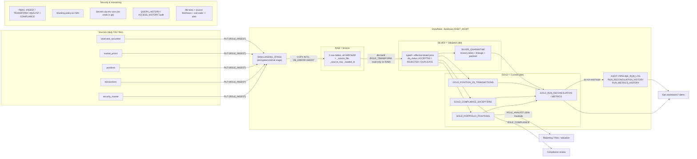

# Architecture

```mermaid
flowchart LR
  subgraph SRC["Sources (daily CSV files)"]
    S1[security_master]:::s
    S2[transactions]:::s
    S3[positions]:::s
    S4[market_prices]:::s
    S5[restricted_securities]:::s
  end

  subgraph SF["Snowflake  -  database ASSET_MGMT"]
    ST["RAW.LANDING_STAGE<br/>(encrypted internal stage)"]
    subgraph B["RAW = Bronze"]
      R["5 raw tables, all VARCHAR<br/>+ _source_file, _source_row, _loaded_at"]
    end
    subgraph SI["SILVER = Validated (dbt)"]
      V["typed + effective-dated joins<br/>dq_status: ACCEPTED / REJECTED / DUPLICATE"]
      Q["SILVER_QUARANTINE<br/>reason codes + lineage + payload"]
    end
    subgraph G["GOLD = Curated (dbt)"]
      G1[GOLD_PORTFOLIO_POSITIONS]
      G2[GOLD_COMPLIANCE_EXCEPTIONS]
      G3[GOLD_POSITION_VS_TRANSACTIONS]
      G4[GOLD_RUN_RECONCILIATION / METRICS]
    end
    AU["AUDIT: PIPELINE_RUN_LOG<br/>RUN_RECONCILIATION_HISTORY<br/>RUN_METRICS_HISTORY"]
  end

  S1 & S2 & S3 & S4 & S5 -->|"PUT (ROLE_INGEST)"| ST
  ST -->|"COPY INTO, ON_ERROR=ABORT"| R
  R -->|"dbt build (ROLE_TRANSFORM, read-only on RAW)"| V
  V --> Q
  V --> G1 & G2 & G3
  G1 & G2 & G3 & Q --> G4
  G4 -->|on-run-end hook| AU

  G1 -->|"ROLE_ANALYST (ISIN masked)"| C1[Reporting / Risk / Valuation]
  G2 -->|ROLE_COMPLIANCE| C2[Compliance review]
  G4 --> C3[Ops dashboard / alerts]
  AU --> C3

  subgraph SEC["Security & monitoring"]
    X1["RBAC: INGEST / TRANSFORM / ANALYST / COMPLIANCE"]
    X2["Masking policy on ISIN"]
    X3["Secrets via env vars (no creds in git)"]
    X4["QUERY_HISTORY / ACCESS_HISTORY audit"]
    X5["dbt tests + source freshness + exit code -> alert"]
  end
  classDef s fill:#eef,stroke:#88a;
```
